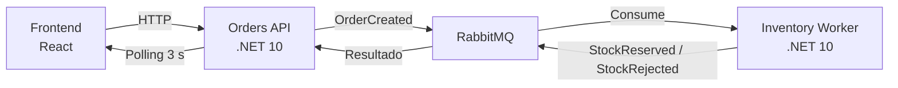

# OrderFlow

Sistema distribuido de pedidos con reserva de inventario asíncrona, desarrollado como prueba técnica. Dos servicios backend en .NET 10 comunicados por eventos vía RabbitMQ, un panel de operaciones en React, y todo orquestado con Docker Compose.

## Índice

- [Arranque rápido](#arranque-rápido)
- [Arquitectura general](#arquitectura-general)
- [Modelo de datos y contratos](#modelo-de-datos-y-contratos)
- [Cómo correr los tests](#cómo-correr-los-tests)
- [Manejo de fallos](#manejo-de-fallos)
- [Decisiones de arquitectura](#decisiones-de-arquitectura)
- [Qué haría distinto con más tiempo](#qué-haría-distinto-con-más-tiempo)

---

## Arranque rápido

### Requisitos

- Docker Desktop (con Docker Compose v2)

### Levantar todo el sistema

```bash
git clone https://github.com/0314mateo/orderflow.git
cd orderflow
docker compose up --build
```

Esto levanta 4 contenedores: RabbitMQ, Orders API, Inventory Worker, y el frontend. La primera corrida tarda varios minutos (descarga de imágenes base + compilación); corridas posteriores son mucho más rápidas.

### URLs disponibles una vez levantado

| Servicio | URL | Notas |
|---|---|---|
| Panel de operaciones (frontend) | http://localhost:3000 | Interfaz principal |
| Orders API | http://localhost:8080 | REST API |
| RabbitMQ (panel de administración) | http://localhost:15672 | Usuario/contraseña: `guest` / `guest` |

> Swagger UI de Orders API está disponible solo en desarrollo local (no en el contenedor Docker, que corre en modo `Production` por decisión de diseño — ver sección de arquitectura). Para explorarlo, correr Orders API localmente con `dotnet run` desde `src/OrderFlow.Orders.Api`.

### Detener el sistema

```bash
docker compose down
```

Agregar `-v` al final (`docker compose down -v`) si además quieres borrar los datos persistidos (pedidos, stock) y volver al estado inicial del seed.

### Primer uso

El sistema siembra automáticamente 3 productos al arrancar (`ABC-01`, `ABC-02`, `ABC-03`) con distintas cantidades de stock. Desde el panel (`http://localhost:3000`) se puede crear un pedido de inmediato — no requiere ningún paso manual adicional.

---

## Arquitectura general



- **Orders API**: expone REST para crear/consultar pedidos. Persiste en su propia base SQLite (`orders.db`).
- **Inventory Worker**: consume eventos, gestiona el stock real. Persiste en su propia base SQLite (`inventory.db`), independiente de Orders.
- **RabbitMQ**: único canal de comunicación entre ambos servicios — nunca comparten base de datos.
- **Frontend**: React + Vite, consulta Orders API por HTTP y refresca la lista de pedidos cada 3 segundos (polling).

### Flujo de un pedido

1. Frontend hace `POST /orders` a Orders API.
2. Orders API valida, persiste el pedido en estado `Pending`, y publica `OrderCreated`.
3. Inventory Worker consume el evento, intenta reservar stock (verificando primero idempotencia por `EventId`).
4. Inventory Worker publica `StockReserved` o `StockRejected` según el resultado.
5. Orders API consume ese evento y actualiza el pedido a `Confirmed` o `Rejected` (con guarda de idempotencia: solo si el pedido seguía en `Pending`).
6. El frontend detecta el cambio en su próximo ciclo de polling.

---

## Modelo de datos y contratos

### Pedido (Orders API)

```json
{
  "id": "guid",
  "clienteNombre": "string",
  "sku": "string",
  "cantidad": 1,
  "estado": "Pending | Confirmed | Rejected",
  "detalle": "string | null",
  "stockRestante": "int | null",
  "creadoEn": "fecha"
}
```
`detalle` y `stockRestante` quedan en `null` mientras el pedido está en `Pending` — se completan cuando Orders API consume la respuesta de Inventory Worker (`StockReserved`/`StockRejected`). `detalle` explica qué pasó ("Stock reservado correctamente" o el motivo de rechazo), y `stockRestante` refleja cuánto quedaba disponible del sku en ese momento.

### Stock (Inventory Worker)

```json
{
  "sku": "string",
  "disponible": 100
}
```

### Endpoints — Orders API

| Método | Ruta | Descripción |
|---|---|---|
| `POST` | `/orders` | Crea un pedido. `201` con el pedido creado, `400` si los datos son inválidos. |
| `GET` | `/orders` | Lista todos los pedidos, más recientes primero. |
| `GET` | `/orders/{id}` | Detalle de un pedido. `404` si no existe. |

**Validación al crear un pedido**: `clienteNombre` no vacío, `sku` debe existir en el catálogo, `cantidad` entre 1 y 100.

### Eventos (proyecto compartido `OrderFlow.Contracts`)

```csharp
// Orders API → Inventory Worker
public record OrderCreated(Guid EventId, Guid OrderId, string Sku, int Cantidad, DateTime OcurridoEn);

// Inventory Worker → Orders API
public record StockReserved(Guid EventId, Guid OrderId, string Sku, int Cantidad, int StockRestante, DateTime OcurridoEn);
public record StockRejected(Guid EventId, Guid OrderId, string Sku, int Cantidad, string Motivo, int StockRestante, DateTime OcurridoEn);
```

Los tres eventos viven en un proyecto de clases compartido, referenciado por ambos servicios — ver la sección de arquitectura para el razonamiento detrás de esta decisión.

---

## Cómo correr los tests

Con el SDK de .NET 10 instalado (no requiere Docker ni RabbitMQ real — los tests usan SQLite en memoria y el test harness de MassTransit):

```bash
dotnet test OrderFlow.slnx
```

Esto corre los **9 tests** del proyecto (ambos proyectos de test) con un solo comando:

| Categoría | Tests | Ubicación |
|---|---|---|
| Idempotencia (Inventory) | 3 | `tests/OrderFlow.Inventory.Tests/StockServiceTests.cs` |
| Validación de pedido | 4 | `tests/OrderFlow.Orders.Tests/PedidoValidatorTests.cs` |
| Transición de estados + idempotencia (Orders) | 2 | `tests/OrderFlow.Orders.Tests/StockConsumersTests.cs` |

El test más relevante para demostrar idempotencia es `ReservarStock_MismoEventIdDosVeces_SoloDescuentaUnaVez`: publica el mismo evento dos veces y confirma que el stock solo se descuenta una vez.

---

## Manejo de fallos

El sistema contempla dos escenarios de falla obligatorios, ambos verificados manualmente durante el desarrollo.

### 1. RabbitMQ caído en el momento en que Orders API intenta publicar

**Comportamiento actual:** el pedido se persiste primero en la base de datos (estado `Pending`), y solo después se intenta publicar el evento `OrderCreated`. Si la publicación falla (por ejemplo, porque el broker no está disponible), la excepción se captura y se registra en el log junto con el `OrderId` afectado. El endpoint igualmente responde `201 Created` — el pedido sí se creó, aunque su procesamiento asíncrono no se disparó.

```csharp
try
{
    await publisher.PublishOrderCreatedAsync(...);
}
catch (Exception ex)
{
    logger.LogError(ex, "No se pudo publicar OrderCreated para el pedido {OrderId}...", pedido.Id);
}
```

**Trade-off asumido:** este pedido queda en `Pending` de forma indefinida — no hay reintento automático ni reconciliación. Se prefirió esta solución simple porque:
- Devolver un error al cliente sería peor: no sabría si el pedido se creó o no, y un reintento de su parte podría generar un pedido duplicado.
- Implementar reintentos automáticos o un patrón *Outbox* (guardar el evento pendiente en una tabla local y republicarlo con un proceso de background hasta confirmar éxito) es la solución robusta para producción, pero se consideró desproporcionada para el alcance de esta prueba.

**Verificado manualmente:** se detuvo el contenedor de RabbitMQ (`docker compose stop rabbitmq`) con Orders API corriendo, se creó un pedido, y se confirmó que: (a) la API respondió `201` sin caerse, (b) el error quedó logueado con el `OrderId`, y (c) el pedido quedó visible en `GET /orders/{id}` con estado `Pending`.

### 2. Inventory Worker caído (o lento) al momento en que Orders API publica `OrderCreated`

**Comportamiento actual:** no requiere manejo especial — es resuelto de forma nativa por la durabilidad de RabbitMQ. Si no hay ningún consumidor activo escuchando la cola `OrderCreated`, el mensaje simplemente permanece almacenado en la cola. En cuanto el Inventory Worker vuelve a estar disponible, MassTransit reanuda el consumo automáticamente, sin pérdida del mensaje ni intervención manual.

**Verificado manualmente:** se detuvo el proceso de `OrderFlow.Inventory.Worker` dejando Orders API corriendo, se creó un pedido (quedó en `Pending`), y al volver a levantar el Worker, este procesó el mensaje pendiente apenas arrancó — el pedido pasó automáticamente a `Confirmed`/`Rejected` sin ninguna acción adicional.

### Resumen comparativo

| Escenario | ¿Se pierde el evento? | ¿Requiere intervención manual? |
|---|---|---|
| Broker caído al publicar | Sí — el evento nunca llega a existir | Sí (reconciliación manual del pedido `Pending` huérfano) |
| Consumidor caído al procesar | No — el mensaje espera en la cola | No — se procesa solo al recuperarse |

Esta asimetría es intencional: proteger contra la caída del *consumidor* es responsabilidad nativa del broker (colas durables), mientras que proteger contra la caída del *broker mismo* en el momento exacto de publicar requeriría persistencia local adicional (Outbox) — documentado como mejora pendiente más abajo.

---

## Decisiones de arquitectura

### Dos servicios independientes, cada uno con su propia base de datos

Orders API e Inventory Worker no comparten base de datos. Cada uno persiste solo lo que necesita para su propia responsabilidad:

- **Orders API** (`orders.db`): pedidos, y un catálogo mínimo (`Producto`) que solo sirve para validar que un `sku` exista al crear un pedido.
- **Inventory Worker** (`inventory.db`): el stock real (`Stock`, con la cantidad que efectivamente se descuenta) y el registro de eventos procesados (`EventosProcesados`) para idempotencia.

Esta separación es la decisión central del diseño: los dos servicios se comunican **exclusivamente por eventos** a través de RabbitMQ, nunca leyendo o escribiendo directamente en la base del otro.

**Trade-off asumido:** hay una duplicación intencional de datos de catálogo (el sku "existe" en ambas bases, aunque con distinto propósito). Se aceptó esta duplicación en vez de que Orders API consultara a Inventory de forma síncrona (por HTTP) para validar el sku, porque eso introduciría un acoplamiento síncrono entre los dos servicios — justo lo que la arquitectura basada en eventos busca evitar.

### Por qué Worker Service (no Web API) para Inventory

Inventory Worker no expone ningún endpoint HTTP — su única función es reaccionar a eventos en segundo plano. Se usó la plantilla **Worker Service** de .NET, basada en `BackgroundService`, la abstracción estándar para procesos de fondo de larga duración.

### Por qué SQLite (y no PostgreSQL/SQL Server)

1. **Cero configuración adicional en Docker Compose** — no requiere levantar un contenedor de base de datos aparte.
2. **El seed y la persistencia de estados mientras el sistema corre** se cumplen igual de bien que con un motor cliente-servidor, para el volumen de esta prueba.
3. **Arranque instantáneo** — agiliza mucho el ciclo de prueba durante el desarrollo.

**Trade-off asumido:** SQLite no es la elección natural para un sistema productivo con alta concurrencia de escritura. Para producción real, este proyecto migraría a PostgreSQL por servicio — cambio que, gracias a EF Core, se reduce en gran parte a cambiar el proveedor (`UseSqlite` → `UseNpgsql`) y la cadena de conexión.

### Por qué Minimal APIs (no Controllers) en Orders API

Para el tamaño de este servicio (3 endpoints), Minimal APIs evita la ceremonia de controladores sin perder claridad — todo el contrato HTTP es legible de un vistazo en `Program.cs`.

### Proyecto compartido de contratos (`OrderFlow.Contracts`)

Los eventos viven en un proyecto referenciado por ambos servicios, en vez de duplicarse en cada uno. Esto convierte un posible error de deserialización en tiempo de ejecución en un error de compilación — mucho más fácil de detectar.

**Trade-off asumido:** acopla a ambos servicios a un proyecto compartido, lo cual en microservicios "puros" a veces se evita. Para dos servicios en el mismo monorepo, mantenidos por la misma persona, es una simplificación razonable.

### MassTransit como capa de transporte (no RabbitMQ.Client directo)

Se usó MassTransit sobre RabbitMQ.Client porque abstrae la gestión de conexión, la serialización JSON, y la configuración de colas/exchanges.

**Nota sobre versión:** el proyecto fija explícitamente `MassTransit 8.5.10` (última versión de la línea 8.x). A partir de la versión 9, MassTransit pasó a requerir una licencia comercial para inicializar el bus — se evitó deliberadamente para mantener el proyecto 100% funcional con herramientas abiertas.

**Nota importante:** la idempotencia y las reglas de transición de estado **no** dependen de ninguna feature avanzada de MassTransit — se implementaron a mano (`EventosProcesados` en Inventory, y la condición `WHERE Estado = Pending` en los consumidores de Orders). La lógica crítica que se evalúa está en código propio, explícito y testeado.

### Idempotencia: dos estrategias distintas, según el contexto

- **Inventory Worker** usa una tabla dedicada (`EventosProcesados`), porque necesita evitar repetir un efecto con estado mutable (descontar stock).
- **Orders API** usa una condición de guarda en el propio `UPDATE` (`WHERE Estado = Pending`), sin tabla adicional, porque su operación es una transición de estado naturalmente idempotente una vez aplicada.

### Por qué React + Vite (no Blazor)

Aunque el stack principal del backend es .NET, se eligió React por preferencia y velocidad de desarrollo. Se usó Vite (no Create React App, deprecado) y JavaScript plano para mantener el alcance proporcional al tiempo disponible.

### Docker — imágenes multi-stage y usuario no root

Cada servicio .NET tiene un Dockerfile de dos etapas: una con el SDK completo (solo para compilar) y otra con el runtime mínimo (`aspnet` para Orders API, `runtime` para Inventory Worker, sin el pipeline web que no necesita). El frontend se compila con Node en una etapa y se sirve con `nginx:alpine` en la otra. Todas las imágenes finales corren como usuario no root (comportamiento por defecto de las imágenes oficiales de Microsoft desde .NET 8), con los volúmenes de datos (`/data`) explícitamente cedidos a ese usuario en el Dockerfile.

Dentro de Docker, cada servicio corre en `ASPNETCORE_ENVIRONMENT=Production` por defecto — por eso Swagger UI no está disponible en el contenedor de Orders API (decisión consciente: no exponer documentación interactiva en un entorno que simula producción).

### Estructura del repositorio (monorepo)

orderflow/
src/
OrderFlow.Contracts/ # eventos compartidos
OrderFlow.Orders.Api/ # servicio HTTP
OrderFlow.Inventory.Worker/ # servicio de background
OrderFlow.Frontend/ # panel de operaciones (React)
tests/
OrderFlow.Orders.Tests/
OrderFlow.Inventory.Tests/
docker-compose.yml

---

## Qué haría distinto con más tiempo

- **Patrón Outbox** para la publicación de `OrderCreated`: en vez de capturar y loguear el fallo de publicación, guardar el evento pendiente en una tabla local (en la misma transacción que el pedido) y tener un proceso de background que reintente publicarlo hasta confirmar éxito. Esto eliminaría por completo el escenario de pedidos `Pending` huérfanos cuando el broker está caído.
- **Reconciliación automática**: un endpoint o job periódico que detecte pedidos `Pending` más antiguos que cierto umbral y los marque para revisión manual, o reintente su publicación.
- **Tests de frontend**: no se escribieron tests de componentes React (mencionado como opcional en el enunciado) — se priorizó backend por ser lo explícitamente evaluado con mayor peso.
- **Actualización en tiempo real con WebSockets/SignalR** en lugar de polling, para reducir la latencia percibida de 3 segundos y el tráfico de red innecesario cuando no hay cambios.
- **Kubernetes**: no se incluyeron manifiestos (bonus opcional del enunciado) por priorización de tiempo hacia los requisitos obligatorios.
- **Migración a PostgreSQL** por servicio, en vez de SQLite, para un entorno más cercano a producción real con mayor concurrencia de escritura.
- **Autenticación/autorización**: explícitamente fuera de alcance según el enunciado, pero sería el siguiente paso natural antes de cualquier despliegue real.