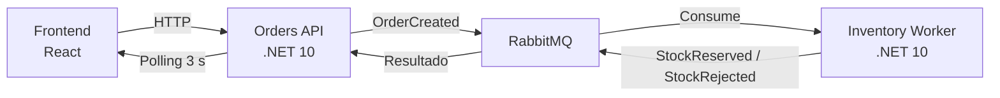

# OrderFlow

Sistema distribuido de pedidos con reserva de inventario asíncrona. Dos servicios backend en .NET 10 comunicados por eventos vía RabbitMQ, un panel de operaciones en React, y todo orquestado con Docker Compose.

## Índice

- [Arranque rápido](#arranque-rápido)
- [Arquitectura general](#arquitectura-general)
- [Modelo de datos y contratos](#modelo-de-datos-y-contratos)
- [Cómo correr los tests](#cómo-correr-los-tests)
- [Manejo de fallos](#manejo-de-fallos)
- [Decisiones de arquitectura](#decisiones-de-arquitectura)
- [Qué haría distinto con más tiempo](#qué-haría-distinto-con-más-tiempo)

---

## Arranque rápido

### Requisitos

- Docker Desktop (con Docker Compose v2)

### Levantar todo el sistema

```bash
git clone https://github.com/0314mateo/orderflow.git
cd orderflow
docker compose up --build -d
```

Esto levanta 4 contenedores: RabbitMQ, Orders API, Inventory Worker, y el frontend. La primera corrida tarda varios minutos (descarga de imágenes base + compilación); corridas posteriores son mucho más rápidas.

### URLs disponibles una vez levantado

| Servicio | URL | Notas |
|---|---|---|
| Panel de operaciones (frontend) | http://localhost:3000 | Interfaz principal |
| Orders API | http://localhost:8080/swagger | REST API |
| RabbitMQ (panel de administración) | http://localhost:15672 | Usuario/contraseña: `guest` / `guest` |


### Detener el sistema

```bash
docker compose down
```

Agregar `-v` al final (`docker compose down -v`) si además quieres borrar los datos persistidos (pedidos, stock) y volver al estado inicial del seed.

### Primer uso

El sistema siembra automáticamente 3 productos al arrancar (`ABC-01`, `ABC-02`, `ABC-03`) con distintas cantidades de stock. Desde el panel (`http://localhost:3000`) se puede crear un pedido de inmediato — no requiere ningún paso manual adicional.

---

## Arquitectura general



- **Orders API**: expone REST para crear/consultar pedidos. Persiste en su propia base SQLite (`orders.db`).
- **Inventory Worker**: consume eventos, gestiona el stock real. Persiste en su propia base SQLite (`inventory.db`), independiente de Orders.
- **RabbitMQ**: único canal de comunicación entre ambos servicios — nunca comparten base de datos.
- **Frontend**: React + Vite, consulta Orders API por HTTP y refresca la lista de pedidos cada 3 segundos (polling).

### Flujo de un pedido

1. Frontend hace `POST /orders` a Orders API.
2. Orders API valida, persiste el pedido en estado `Pending`, y publica `OrderCreated`.
3. Inventory Worker consume el evento, intenta reservar stock (verificando primero idempotencia por `EventId`).
4. Inventory Worker publica `StockReserved` o `StockRejected` según el resultado.
5. Orders API consume ese evento y actualiza el pedido a `Confirmed` o `Rejected` (con guarda de idempotencia: solo si el pedido seguía en `Pending`).
6. El frontend detecta el cambio en su próximo ciclo de polling.

### Catálogo de productos en la interfaz

El panel no solo trabaja con el `sku` — el formulario y la tabla de pedidos muestran el **nombre legible** de cada producto (ej. "Teclado mecánico" en vez de solo "ABC-01"), consultando `GET /products` una vez al cargar. Esto no fue un requisito explícito del enunciado, pero es una mejora de bajo costo que usa datos que el sistema ya calculaba (el campo `Nombre` del seed) y no estaba exponiendo. Deliberadamente **no** se implementó gestión de catálogo (alta/edición de productos desde el panel) — el enunciado no lo pide, y el catálogo fijo vía seed es proporcional al alcance de la prueba.

---

## Modelo de datos y contratos

### Pedido (Orders API)

```json
{
  "id": "guid",
  "clienteNombre": "string",
  "sku": "string",
  "cantidad": 1,
  "estado": "Pending | Confirmed | Rejected",
  "detalle": "string | null",
  "stockRestante": "int | null",
  "creadoEn": "fecha"
}
```
`detalle` y `stockRestante` quedan en `null` mientras el pedido está en `Pending` — se completan cuando Orders API consume la respuesta de Inventory Worker (`StockReserved`/`StockRejected`). `detalle` explica qué pasó ("Stock reservado correctamente" o el motivo de rechazo), y `stockRestante` refleja cuánto quedaba disponible del sku en ese momento.

### Stock (Inventory Worker)

```json
{
  "sku": "string",
  "disponible": 100
}
```
### Catálogo (respuesta de `GET /products`)

```json
[
  { "sku": "ABC-01", "nombre": "Teclado mecánico" },
  { "sku": "ABC-02", "nombre": "Mouse inalámbrico" },
  { "sku": "ABC-03", "nombre": "Monitor 24\"" }
]
```

### Endpoints — Orders API

| Método | Ruta | Descripción |
|---|---|---|
| `POST` | `/orders` | Crea un pedido. `201` con el pedido creado, `400` si los datos son inválidos. |
| `GET` | `/orders` | Lista todos los pedidos, más recientes primero. |
| `GET` | `/orders/{id}` | Detalle de un pedido. `404` si no existe. |
| `GET` | `/products` | Lista el catálogo (`sku`, `nombre`) — usado por el frontend para mostrar nombres legibles en vez de solo el código de producto. |

**Validación al crear un pedido**: `clienteNombre` no vacío, `sku` debe existir en el catálogo, `cantidad` entre 1 y 100.

### Eventos (proyecto compartido `OrderFlow.Contracts`)

```csharp
// Orders API → Inventory Worker
public record OrderCreated(Guid EventId, Guid OrderId, string Sku, int Cantidad, DateTime OcurridoEn);

// Inventory Worker → Orders API
public record StockReserved(Guid EventId, Guid OrderId, string Sku, int Cantidad, int StockRestante, DateTime OcurridoEn);
public record StockRejected(Guid EventId, Guid OrderId, string Sku, int Cantidad, string Motivo, int StockRestante, DateTime OcurridoEn);
```

Los tres eventos viven en un proyecto de clases compartido, referenciado por ambos servicios — ver la sección de arquitectura para el razonamiento detrás de esta decisión.

---

## Cómo correr los tests

Con el SDK de .NET 10 instalado (no requiere Docker ni RabbitMQ real — los tests usan SQLite en memoria y el test harness de MassTransit):

```bash
dotnet test OrderFlow.slnx
```

Esto corre los **9 tests** del proyecto (ambos proyectos de test) con un solo comando:

| Categoría | Tests | Ubicación |
|---|---|---|
| Idempotencia (Inventory) | 3 | `tests/OrderFlow.Inventory.Tests/StockServiceTests.cs` |
| Validación de pedido | 4 | `tests/OrderFlow.Orders.Tests/PedidoValidatorTests.cs` |
| Transición de estados + idempotencia (Orders) | 2 | `tests/OrderFlow.Orders.Tests/StockConsumersTests.cs` |

El test más relevante para demostrar idempotencia es `ReservarStock_MismoEventIdDosVeces_SoloDescuentaUnaVez`: publica el mismo evento dos veces y confirma que el stock solo se descuenta una vez.

---

## Manejo de fallos

El sistema contempla dos escenarios de falla obligatorios, ambos verificados manualmente durante el desarrollo.

### 1. RabbitMQ caído en el momento en que Orders API intenta publicar

**Comportamiento actual:** el pedido se persiste primero en la base de datos (estado `Pending`), y solo después se intenta publicar el evento `OrderCreated`. Si la publicación falla (por ejemplo, porque el broker no está disponible), la excepción se captura y se registra en el log junto con el `OrderId` afectado. El endpoint igualmente responde `201 Created` — el pedido sí se creó, aunque su procesamiento asíncrono no se disparó.

```csharp
try
{
    await publisher.PublishOrderCreatedAsync(...);
}
catch (Exception ex)
{
    logger.LogError(ex, "No se pudo publicar OrderCreated para el pedido {OrderId}...", pedido.Id);
}
```

**Trade-off asumido:** este pedido queda en `Pending` de forma indefinida — no hay reintento automático ni reconciliación. Se prefirió esta solución simple porque:
- Devolver un error al cliente sería peor: no sabría si el pedido se creó o no, y un reintento de su parte podría generar un pedido duplicado.
- Implementar reintentos automáticos o un patrón *Outbox* (guardar el evento pendiente en una tabla local y republicarlo con un proceso de background hasta confirmar éxito) es la solución robusta para producción, pero se consideró desproporcionada para el alcance de esta prueba.

**Verificado manualmente:** se detuvo el contenedor de RabbitMQ (`docker compose stop rabbitmq`) con Orders API corriendo, se creó un pedido, y se confirmó que: (a) la API respondió `201` sin caerse, (b) el error quedó logueado con el `OrderId`, y (c) el pedido quedó visible en `GET /orders/{id}` con estado `Pending`.

### 2. Inventory Worker caído (o lento) al momento en que Orders API publica `OrderCreated`

**Comportamiento actual:** no requiere manejo especial — es resuelto de forma nativa por la durabilidad de RabbitMQ. Si no hay ningún consumidor activo escuchando la cola `OrderCreated`, el mensaje simplemente permanece almacenado en la cola. En cuanto el Inventory Worker vuelve a estar disponible, MassTransit reanuda el consumo automáticamente, sin pérdida del mensaje ni intervención manual.

**Verificado manualmente:** se detuvo el proceso de `OrderFlow.Inventory.Worker` dejando Orders API corriendo, se creó un pedido (quedó en `Pending`), y al volver a levantar el Worker, este procesó el mensaje pendiente apenas arrancó — el pedido pasó automáticamente a `Confirmed`/`Rejected` sin ninguna acción adicional.

### Resumen comparativo

| Escenario | ¿Se pierde el evento? | ¿Requiere intervención manual? |
|---|---|---|
| Broker caído al publicar | Sí — el evento nunca llega a existir | Sí (reconciliación manual del pedido `Pending` huérfano) |
| Consumidor caído al procesar | No — el mensaje espera en la cola | No — se procesa solo al recuperarse |

Esta asimetría es intencional: proteger contra la caída del *consumidor* es responsabilidad nativa del broker (colas durables), mientras que proteger contra la caída del *broker mismo* en el momento exacto de publicar requeriría persistencia local adicional (Outbox) — documentado como mejora pendiente más abajo.

---

## Decisiones de arquitectura

**Dos bases de datos independientes.** Orders API (`orders.db`) e Inventory Worker (`inventory.db`) nunca comparten base — se comunican solo por eventos vía RabbitMQ. Hay duplicación intencional de catálogo (Orders solo valida que el sku exista; Inventory tiene el stock real) para evitar acoplar los servicios con llamadas síncronas.

**Worker Service para Inventory.** No expone HTTP, solo reacciona a eventos — `BackgroundService` es la abstracción correcta para eso, no una Web API vacía.

**SQLite en ambos servicios.** Cero configuración extra en Docker Compose y arranque instantáneo, suficiente para el volumen de esta prueba. Para producción real, migraría a PostgreSQL por servicio.

**Minimal APIs en Orders API.** Con solo 3-5 endpoints, evita la ceremonia de Controllers sin perder legibilidad.

**Proyecto de contratos compartido (`OrderFlow.Contracts`).** Los eventos (`OrderCreated`, `StockReserved`, `StockRejected`) viven en un proyecto referenciado por ambos servicios — un cambio incompatible se detecta en compilación, no en producción como error de deserialización. Acopla ambos servicios a un proyecto común, aceptable por ser un monorepo mantenido por una sola persona.

**MassTransit sobre RabbitMQ.Client directo**, para abstraer conexión, serialización y topología de colas. Se fija explícitamente en `8.5.10` porque desde la v9 MassTransit requiere licencia comercial. La idempotencia y las transiciones de estado están implementadas a mano (no dependen de features de la librería): `EventosProcesados` en Inventory, y `WHERE Estado = Pending` en los consumers de Orders — cada uno con la estrategia mínima que su caso requiere (tabla dedicada donde el efecto es mutable, guarda en el `UPDATE` donde la operación ya es naturalmente idempotente).

**React + Vite** para el frontend, por preferencia y velocidad de desarrollo, aunque el backend sea .NET.

**Docker multi-stage con usuario no root.** Cada servicio .NET compila con el SDK completo en una etapa y corre en runtime mínimo en otra (`aspnet` para Orders API, `runtime` para Inventory Worker, sin pipeline web innecesario). El frontend se compila con Node y se sirve con `nginx:alpine`. Todas las imágenes corren como usuario no root, con `/data` explícitamente cedido a ese usuario. Orders API fuerza `ASPNETCORE_ENVIRONMENT=Development` en Docker para mantener Swagger accesible durante la evaluación de esta prueba (en producción real se retiraría esa variable).


### Estructura del repositorio (monorepo)

```text
orderflow/
├── src/
│   ├── OrderFlow.Contracts/           # Eventos compartidos
│   ├── OrderFlow.Orders.Api/          # Servicio HTTP
│   ├── OrderFlow.Inventory.Worker/    # Servicio de background
│   └── OrderFlow.Frontend/            # Panel de operaciones (React)
├── tests/
│   ├── OrderFlow.Orders.Tests/
│   └── OrderFlow.Inventory.Tests/
└── docker-compose.yml
```

---

## ¿Qué haría diferente con más tiempo?

- **Despliegue en Kubernetes**: crear los manifiestos YAML necesarios para desplegar toda la solución en un clúster de Kubernetes. Utilizaría Rancher para simplificar la administración, el despliegue y la gestión de múltiples entornos.

- **Migración a PostgreSQL**: reemplazar SQLite por una base de datos PostgreSQL independiente para cada servicio, acercando la arquitectura a un entorno de producción con mejor soporte para concurrencia, escalabilidad y persistencia.

- **Autenticación y autorización**: aunque el enunciado excluye explícitamente esta funcionalidad, sería el siguiente paso antes de un despliegue real, implementando autenticación basada en JWT y autorización por roles.

- **Reconciliación automática de pedidos**: incorporar un proceso en segundo plano o un endpoint administrativo que identifique pedidos en estado `Pending` durante un tiempo determinado, permitiendo reintentar su procesamiento o marcarlos para revisión manual.

- **Panel de administración de productos**: desarrollar una interfaz para la gestión del catálogo, permitiendo crear, editar y eliminar productos, así como administrar su inventario sin necesidad de modificar la base de datos directamente.

- **Actualizaciones en tiempo real**: sustituir el mecanismo de polling por WebSockets mediante SignalR, reduciendo la latencia percibida y evitando consultas periódicas innecesarias cuando no existen cambios.

